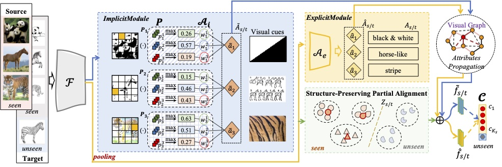

# XSR-OSDA
:fire: Implementation for the ''Interpretable Novel Target Discovery Through Open-Set Domain Adaptation (**XSR-OSDA**)'' work (*under review*).

*XSR-OSDA is an extension work of the "**SR-OSDA**" published in ICCV 2021 [[paper](https://openaccess.thecvf.com/content/ICCV2021/papers/Jing_Towards_Novel_Target_Discovery_Through_Open-Set_Domain_Adaptation_ICCV_2021_paper.pdf)][[Github](https://github.com/scottjingtt/SROSDA/tree/main)].*




## Data Preparation
---
- [I->AwA](./data/I2AwA/dataset_info.txt): 3D2 and AwA2
- [DomainNet -> AwA](./data/D2AwA/classes.txt): DomainNet & AwA2
- [DomainNet -> LAD](./data/D2LAD/classes.txt): DomainNet & LAD

|Dataset|Domain|Role|#Images|#Attributes|#Classes|
|:-:|:-:|:-:|:-:|:-:|:-:|
|DomainNet $\rightarrow$ AwA2|AwA <br> Paint <br> Real|S / T|9,343 / 15,306 <br> 3,441 / 5,760 <br> 5,251 / 10,047|85|10 / 17|
|I $\rightarrow$ AwA         |I / AwA | S / T | 2,970 / 37,322 | 85 | 40 / 50 |
|Domain $\rightarrow$ LAD| LAD <br> Paint <br> Real | S / T | 13,322 / 19,744 <br> 11,714 / 15,311 <br> 22,395 / 31,066 | 253 | 40 / 56 |


## Dependencies
---
- Python 3.8
- Pytorch 1.10


## Training
---
```shell
python main.py
```

## Evaluation
---

- Open-set Domain Adaptation Task

> $OS^*$: class-wise average accuracy on the seen categories.
>
> $OS^\diamond$: class-wise average accuracy on the unseen categories correctly classified as "unknown".
>
> $OS$: $\frac{OS^* \times C_{shr} + OS^\diamond}{C_{shr} + 1}$

> $OS^{H}$: $\frac{ 2 \times OS^* \times OS^\diamond}{OS^* + OS^\diamond}$

- Semantic-Recovery Open-Set Domain Adaptation Task

> $S$: class-wise average accuracy on shared classes
>
> $U$: class-wise average accuracy on unknown classes
>
> $H = \frac{2 \times S \times U}{ S + U}$

## Citation
---
If you think this work is interesting, please cite:
```
@InProceedings{Jing_2021_XSROSDA,
author = {Jing, Taotao and Xia, Haifeng and Liu, Hongfu and Ding, Zhengming},
title = {Interpretable Novel Target Discovery Through Open-Set Domain Adaptation},
booktitle = {},
year = {}
}
```

## Contact
---
If you have any questions about this work, feel free to contact
- tjing@tulane.edu
